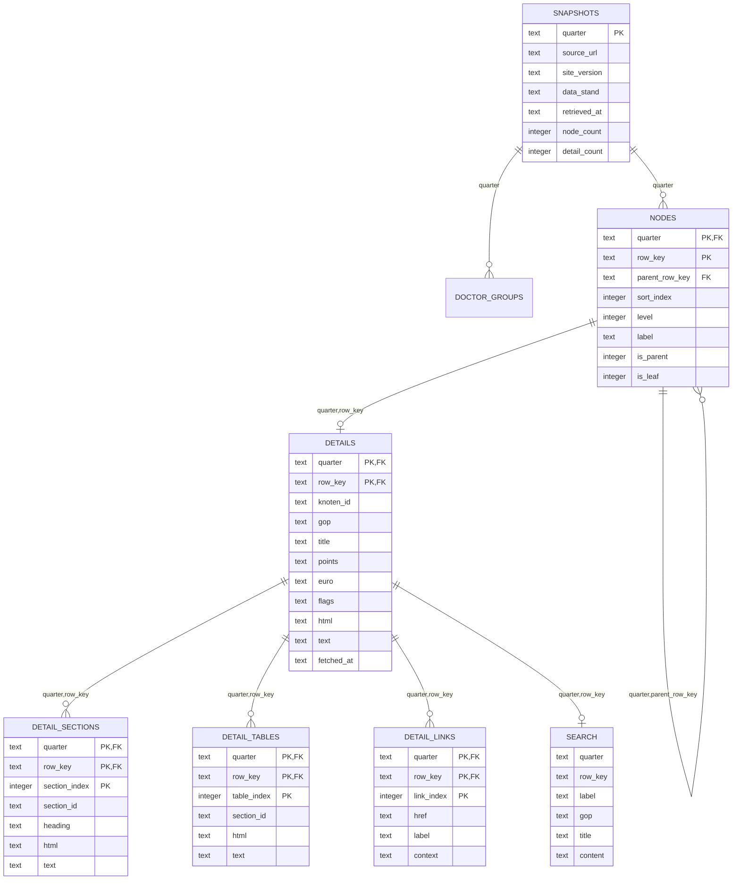

# EBM-KBV-Datenbank

Diese Dokumentation beschreibt den Abruf der Webseite `https://ebm.kbv.de/`, die lokale SQLite-Datenbank und die Quartals-Versionierung der EBM-Daten.

## Fachlicher Grundsatz

EBM-Daten sind quartalsabhängig. Für die Abrechnung ist nicht entscheidend, wann eine Rechnung erstellt wird, sondern in welchem Quartal die Behandlung erbracht wurde.

Beispiel:

| Behandlung | Rechnung | Zu verwendender EBM-Stand |
| --- | --- | --- |
| 15.02.2026 | 10.04.2026 | `2026/Q1` |
| 02.04.2026 | 30.06.2026 | `2026/Q2` |

Deshalb ist die Datenbank jetzt versioniert: Alle fachlichen Tabellen enthalten ein Feld `quarter`. Eine GOP wird also immer mit Quartal abgefragt, z. B. `gop = '33000'` und `quarter = '2026/Q2'`.

## Ergebnis

Die fertige SQLite-Datenbank liegt hier:

```text
/Users/cro/Documents/varisano - ebm Abrechnungsservice/ebm_kbv.sqlite
```

Der alte nicht-versionierte Stand wurde vor der Migration gesichert:

```text
/Users/cro/Documents/varisano - ebm Abrechnungsservice/ebm_kbv_pre_versioning_backup.sqlite
```

Vor dem Import von `2025/Q4` wurde außerdem der bereits versionierte Stand gesichert:

```text
/Users/cro/Documents/varisano - ebm Abrechnungsservice/ebm_kbv_before_2025Q4_import.sqlite
```

Vor dem Import der hessenspezifischen GOP wurde der Stand zusätzlich gesichert:

```text
/Users/cro/Documents/varisano - ebm Abrechnungsservice/ebm_kbv_before_hessen_gop_import.sqlite
```

Aktuell enthaltene Snapshots:

| Quartal | Baumknoten | Detaildatensätze | Integritätsprüfung |
| --- | ---: | ---: | --- |
| `2025/Q4` | `3.850` | `3.850` | `ok` |
| `2026/Q2` | `3.879` | `3.879` | `ok` |

Aktuell enthaltene regionale Zusatzkataloge:

| Katalog | Region | Quartal | Stand | Seiten | GOP-Einträge | Regeln | Kanten | Kassen/VKNR |
| --- | --- | --- | --- | ---: | ---: | ---: | ---: | ---: |
| `KV_HESSEN_GOP` | Hessen | `2025/Q4` | 30.09.2025 | `66` | `641` | `2.362` | `4.272` | `168` |

## Was gemacht wurde

1. Die Startseite `https://ebm.kbv.de/` wurde abgerufen.
2. Die Webseite wurde technisch analysiert. Sie ist eine JSF/PrimeFaces-Anwendung, keine einfache statische HTML-Seite.
3. Die AJAX-Mechanik der Baumansicht wurde nachvollzogen:
   - `mainForm:tree_expandNode` lädt Unterknoten im EBM-Baum.
   - `mainForm:tree_instantSelection` lädt die Detailansicht eines Knotens.
   - `headerForm:quartalCombobox` wechselt das Quartal.
4. Ein wiederverwendbarer Scraper wurde erstellt:

```text
/Users/cro/Documents/varisano - ebm Abrechnungsservice/scripts/scrape_ebm_kbv.py
```

5. Die bestehende Datenbank wurde auf ein versioniertes Schema migriert.
6. Der vorhandene Stand wurde als Snapshot `2026/Q2` gespeichert.
7. Der Snapshot `2025/Q4` wurde zusätzlich importiert, damit Rechnungen aus dem Behandlungsquartal `2025/Q4` gegen den passenden EBM-Stand geprüft werden können.
8. Die Datenbank wurde per `PRAGMA integrity_check` geprüft.

## Wichtige Dateien

| Datei | Zweck |
| --- | --- |
| `ebm_kbv.sqlite` | Versionierte SQLite-Datenbank mit EBM-Inhalten |
| `scripts/scrape_ebm_kbv.py` | Wiederverwendbarer Scraper zum Import weiterer Quartale |
| `scripts/import_hessen_gop_pdf.py` | Importer fuer hessenspezifische GOP-PDFs in regionale Tabellen |
| `EBM_Hessen_Abrechnungssoftware_Konzept.md` | Zielkonzept fuer PDF-Upload, Mistral-OCR, Dokumentsegmentierung, Evidenzsuche, EBM/Hessen-GOP-Ableitung und Standardexport |
| `Rechnung_25130195_Regelableitung.md` | Aus dem Beispielbehandlungsfall abgeleitete erste Abrechnungsregeln |
| `ebm_kbv_pre_versioning_backup.sqlite` | Sicherung des alten nicht-versionierten Stands |
| `ebm_kbv_before_2025Q4_import.sqlite` | Sicherung des versionierten Stands vor Import von `2025/Q4` |
| `ebm_kbv_before_hessen_gop_import.sqlite` | Sicherung vor dem Import der hessenspezifischen GOP |
| `ebm_startseite.html` | Lokal gespeicherte Startseite zur Analyse |
| `ebis.js` | Lokal gespeicherte EBM-JavaScript-Datei zur Analyse |
| `primefaces-components.js` | Lokal gespeicherte PrimeFaces-Komponentenlogik zur Analyse |
| `ebm_kbv_test.sqlite` | Kleine Testdatenbank aus dem ersten Probelauf |
| `ebm_kbv_versioned_test.sqlite` | Kleine Testdatenbank fuer das versionierte Schema |

## Datenbankstruktur

Die wichtigsten Tabellen sind:

| Tabelle | Inhalt |
| --- | --- |
| `metadata` | Globale Metadaten, vor allem zum letzten Import |
| `snapshots` | Ein Datensatz pro importiertem Quartal |
| `quarters` | Auf der Webseite verfuegbare Quartale |
| `doctor_groups` | Arztgruppenfilter je Quartal |
| `nodes` | Baumstruktur je Quartal |
| `details` | Detailinhalt je Quartal und Knoten, inkl. GOP, Titel, Punkte, Euro, HTML und Text |
| `detail_sections` | Aus den Detailseiten extrahierte Inhaltsabschnitte je Quartal |
| `detail_tables` | Tabellen aus den Detailseiten je Quartal |
| `detail_links` | Interne EBM-Verlinkungen je Quartal |
| `search` | Volltextsuche mit Quartalsfeld |
| `regional_catalogs` | Regionale Zusatzkataloge, z. B. KV Hessen GOP `2025/Q4` |
| `regional_gop_pages` | Rohtext der PDF-Seiten regionaler Kataloge |
| `regional_gop_tables` | Rohzeilen der aus PDFs extrahierten Tabellen |
| `regional_gops` | Normalisierte regionale GOP-Einträge mit Basis-GOP, Suffix, Markern, Bewertung und Quelle |
| `regional_gop_rules` | Aus Beschreibungstexten abgeleitete Regeln |
| `regional_gop_edges` | Aus Regeln abgeleitete GOP-Beziehungen, z. B. Ausschlüsse oder Voraussetzungen |
| `regional_gop_payers` | Kassen-/VKNR-Zuordnungen aus regionalen Vertragsabschnitten |

## Datenmodell im Detail

### `snapshots`

| Spalte | Typ | Bedeutung |
| --- | --- | --- |
| `quarter` | `TEXT` | Quartal, z. B. `2026/Q2`; Primaerschluessel |
| `source_url` | `TEXT` | Quelle des Abrufs |
| `site_version` | `TEXT` | Versionsnummer der KBV-Webanwendung |
| `data_stand` | `TEXT` | Datenstand laut KBV-Seite |
| `retrieved_at` | `TEXT` | Abrufzeitpunkt im ISO-Format |
| `node_count` | `INTEGER` | Anzahl gespeicherter Baumknoten fuer dieses Quartal |
| `detail_count` | `INTEGER` | Anzahl gespeicherter Detailseiten fuer dieses Quartal |

### `metadata`

| Spalte | Typ | Bedeutung |
| --- | --- | --- |
| `key` | `TEXT` | Name des Metadatums |
| `value` | `TEXT` | Wert des Metadatums |

Diese Tabelle ist global. Fuer fachliche Quartalsinformationen ist `snapshots` die massgebliche Tabelle.

### `quarters`

| Spalte | Typ | Bedeutung |
| --- | --- | --- |
| `quarter` | `TEXT` | Auf der Webseite auswählbares Quartal |
| `selected` | `INTEGER` | `1`, wenn dieses Quartal beim letzten Abruf ausgewählt war |

### `doctor_groups`

| Spalte | Typ | Bedeutung |
| --- | --- | --- |
| `quarter` | `TEXT` | Quartal |
| `name` | `TEXT` | Name eines Arztgruppenfilters |

Primaerschluessel: `(quarter, name)`.

### `nodes`

| Spalte | Typ | Bedeutung |
| --- | --- | --- |
| `quarter` | `TEXT` | Quartal |
| `row_key` | `TEXT` | Technischer Schlüssel des Baumknotens in der PrimeFaces-Baumansicht |
| `parent_row_key` | `TEXT` | Uebergeordneter Baumknoten, bei Wurzelknoten leer |
| `sort_index` | `INTEGER` | Reihenfolge innerhalb des Elternknotens |
| `level` | `INTEGER` | Tiefe im Baum |
| `label` | `TEXT` | Angezeigter Titel des Baumknotens |
| `is_parent` | `INTEGER` | `1`, wenn der Knoten Unterknoten hat |
| `is_leaf` | `INTEGER` | `1`, wenn der Knoten ein Blattknoten ist |

Primaerschluessel: `(quarter, row_key)`.

### `details`

| Spalte | Typ | Bedeutung |
| --- | --- | --- |
| `quarter` | `TEXT` | Quartal |
| `row_key` | `TEXT` | Verweis auf `nodes.row_key` innerhalb desselben Quartals |
| `knoten_id` | `TEXT` | Interne KBV-Knoten-ID aus der Detailansicht |
| `gop` | `TEXT` | Gebührenordnungsposition oder Abschnittskennung |
| `title` | `TEXT` | Titel der Detailseite |
| `points` | `TEXT` | Punkte, falls vorhanden |
| `euro` | `TEXT` | Euro-Wert, falls vorhanden |
| `flags` | `TEXT` | Kennzeichen wie `Berichtspflichtig`, zeilengetrennt |
| `html` | `TEXT` | Original-HTML der Detailansicht |
| `text` | `TEXT` | Bereinigter Klartext der Detailansicht |
| `fetched_at` | `TEXT` | Zeitpunkt des Abrufs im ISO-Format |

Primaerschluessel: `(quarter, row_key)`.

Wichtig: `html` ist die möglichst originalnahe Detailansicht. `text` ist daraus extrahierter Klartext fuer Suche, Analyse und schnelle Anzeige.

### `detail_sections`

| Spalte | Typ | Bedeutung |
| --- | --- | --- |
| `quarter` | `TEXT` | Quartal |
| `row_key` | `TEXT` | Verweis auf `details.row_key` innerhalb desselben Quartals |
| `section_index` | `INTEGER` | Reihenfolge der Sektion innerhalb der Detailseite |
| `section_id` | `TEXT` | HTML-ID der Sektion, z. B. `beschreibung` |
| `heading` | `TEXT` | Überschrift der Sektion |
| `html` | `TEXT` | HTML dieser Sektion |
| `text` | `TEXT` | Klartext dieser Sektion |

Primaerschluessel: `(quarter, row_key, section_index)`.

Einige Sektionen haben keine `heading`, z. B. Kopfbereich und Kennzahlenblock einer GOP. Die Reihenfolge bleibt ueber `section_index` erhalten.

### `detail_tables`

| Spalte | Typ | Bedeutung |
| --- | --- | --- |
| `quarter` | `TEXT` | Quartal |
| `row_key` | `TEXT` | Verweis auf `details.row_key` innerhalb desselben Quartals |
| `table_index` | `INTEGER` | Reihenfolge der Tabelle innerhalb der Detailseite |
| `section_id` | `TEXT` | Sektion, in der die Tabelle gefunden wurde |
| `html` | `TEXT` | Tabellen-HTML |
| `text` | `TEXT` | Tabelleninhalt als Klartext |

Primaerschluessel: `(quarter, row_key, table_index)`.

### `detail_links`

| Spalte | Typ | Bedeutung |
| --- | --- | --- |
| `quarter` | `TEXT` | Quartal |
| `row_key` | `TEXT` | Detailseite, auf der der Link gefunden wurde |
| `link_index` | `INTEGER` | Reihenfolge des Links innerhalb der Detailseite |
| `href` | `TEXT` | Interne KBV-Ziel-ID |
| `label` | `TEXT` | Sichtbarer Linktext, oft eine andere GOP |
| `context` | `TEXT` | Textumgebung des Links |

Primaerschluessel: `(quarter, row_key, link_index)`.

### `search`

| Spalte | Typ | Bedeutung |
| --- | --- | --- |
| `quarter` | FTS, nicht indexiert | Quartal |
| `row_key` | FTS, nicht indexiert | Verweis auf `details.row_key` |
| `label` | FTS | Baumlabel |
| `gop` | FTS | GOP oder Abschnittskennung |
| `title` | FTS | Titel |
| `content` | FTS | Volltext der Detailseite |

`search` ist eine SQLite-FTS5-Tabelle. Sie ist fuer Volltextsuche gedacht, nicht als kanonische Datentabelle.

## Schema-Diagramm



## Zugriff per Terminal

In den Projektordner wechseln:

```bash
cd "/Users/cro/Documents/varisano - ebm Abrechnungsservice"
```

SQLite interaktiv öffnen:

```bash
sqlite3 ebm_kbv.sqlite
```

Tabellen anzeigen:

```sql
.tables
```

Importierte Quartale anzeigen:

```sql
select quarter, data_stand, retrieved_at, node_count, detail_count
from snapshots
order by quarter;
```

## Typische Abfragen

GOP exakt fuer ein Quartal suchen:

```sql
select quarter, row_key, gop, title, points, euro
from details
where quarter = '2026/Q2'
  and gop = '33000';
```

Beispielausgabe:

```text
2026/Q2|3_3_0|33000|Sonographie des Auges|95|12.10
```

GOP ueber mehrere Quartale vergleichen:

```sql
select quarter, gop, title, points, euro
from details
where gop = '33000'
order by quarter;
```

GOP nach Nummernpraefix in einem Quartal suchen:

```sql
select gop, title, points, euro
from details
where quarter = '2026/Q2'
  and gop like '33%'
order by gop
limit 50;
```

Alle Leistungen mit Punkten oder Euro-Wert in einem Quartal listen:

```sql
select gop, title, points, euro
from details
where quarter = '2026/Q2'
  and gop <> ''
  and (points <> '' or euro <> '')
order by gop;
```

Volltextsuche in einem Quartal:

```sql
select quarter, row_key, gop, title
from search
where search match 'Sonographie'
  and quarter = '2026/Q2'
limit 20;
```

Unterpunkte eines Kapitels anzeigen:

```sql
select child.row_key, child.label
from nodes as parent
join nodes as child
  on child.quarter = parent.quarter
 and child.parent_row_key = parent.row_key
where parent.quarter = '2026/Q2'
  and parent.label like '33 Ultraschalldiagnostik%'
order by child.sort_index;
```

Abschnitte einer GOP anzeigen:

```sql
select s.heading, s.text
from details as d
join detail_sections as s
  on s.quarter = d.quarter
 and s.row_key = d.row_key
where d.quarter = '2026/Q2'
  and d.gop = '33000'
order by s.section_index;
```

Tabellen einer GOP anzeigen, z. B. Abrechnungsausschluesse:

```sql
select t.section_id, t.text
from details as d
join detail_tables as t
  on t.quarter = d.quarter
 and t.row_key = d.row_key
where d.quarter = '2026/Q2'
  and d.gop = '33000'
order by t.table_index;
```

Interne Links aus einer GOP anzeigen:

```sql
select l.label, l.href, l.context
from details as d
join detail_links as l
  on l.quarter = d.quarter
 and l.row_key = d.row_key
where d.quarter = '2026/Q2'
  and d.gop = '33000'
order by l.link_index;
```

Regionale Hessen-GOP suchen:

```sql
select gop_code, gop_original, title, valuation_text, page
from regional_gops
where quarter = '2025/Q4'
  and region = 'Hessen'
  and gop_code = '90401A';
```

Regeln zu einer regionalen GOP anzeigen:

```sql
select rule_type, rule_text
from regional_gop_rules
where quarter = '2025/Q4'
  and region = 'Hessen'
  and gop_code = '92101'
order by id;
```

Kassen-/VKNR-Kontexte aus regionalen Vertragsabschnitten anzeigen:

```sql
select context, payer_name, vknr
from regional_gop_payers
where catalog_id = 'kv_hessen_gop_2025_q4'
order by context, payer_name;
```

## Quartal aus einem Behandlungsdatum ableiten

In der Anwendung sollte aus dem Behandlungsdatum ein Quartal berechnet werden:

| Monat | Quartal |
| --- | --- |
| Januar bis Maerz | `Q1` |
| April bis Juni | `Q2` |
| Juli bis September | `Q3` |
| Oktober bis Dezember | `Q4` |

Beispiel:

```text
Behandlungsdatum: 2026-02-15
EBM-Quartal:      2026/Q1
```

Danach wird immer mit diesem Quartal abgefragt:

```sql
select gop, title, points, euro
from details
where quarter = '2026/Q1'
  and gop = '33000';
```

## Neues Quartal importieren

Ein bestimmtes Quartal kann gezielt importiert werden:

```bash
PYTHONPYCACHEPREFIX=.pycache python3 scripts/scrape_ebm_kbv.py \
  --db ebm_kbv.sqlite \
  --quarter 2026/Q1 \
  --replace-quarter \
  --delay 0.02 \
  --progress-every 100 \
  --commit-every 100
```

Wichtige Optionen:

| Option | Bedeutung |
| --- | --- |
| `--quarter 2026/Q1` | Waehlt ein bestimmtes Quartal auf der KBV-Seite aus |
| `--replace-quarter` | Loescht nur dieses Quartal in der DB und importiert es neu |
| `--resume` | Ueberspringt bereits vorhandene Details fuer dieses Quartal |
| `--reset` | Loescht alle Quartale und baut die DB neu auf |

Fuer den laufenden Betrieb sollte normalerweise `--replace-quarter` fuer ein einzelnes Quartal verwendet werden, nicht `--reset`.

## Einordnung in die Gesamtanwendung

Die EBM-KBV-Datenbank ist die versionierte Referenzschicht fuer ein groesseres Abrechnungs- und Dokumentationssystem.

Weitere fachliche Komponenten sind:

| Komponente | Aufgabe |
| --- | --- |
| `patients` | Patientendaten und abrechnungsrelevante Stammdaten |
| `treatments` | Konkrete Behandlung mit Behandlungsdatum und daraus abgeleitetem EBM-Quartal |
| `treatment_reports` | Medizinische Dokumentation zur Behandlung |
| `billing_items` | Aus Behandlung und Bericht abgeleitete Abrechnungspositionen |
| `invoices` | Rechnungen, die ggf. erst in einem spaeteren Quartal erstellt werden |
| `ebm_kbv` | Quartalsversionierte Referenzdaten fuer GOP, Punkte, Euro, Regeln, Ausschluesse und Texte |

Prinzip:

```text
Patient
  -> Behandlung
      -> Behandlungsbericht
      -> Abrechnungsposition
          -> EBM-KBV-Daten nach Behandlungsquartal
```

Eine Abrechnungsposition sollte deshalb mindestens speichern:

| Feld | Bedeutung |
| --- | --- |
| `treatment_id` | Bezug zur Behandlung |
| `quarter` | Aus dem Behandlungsdatum abgeleitetes EBM-Quartal |
| `gop` | Abgerechnete Gebührenordnungsposition |
| `gop_base` | Basis-GOP ohne abrechnungstechnischen Suffix, z. B. `32035` aus `32035A` |
| `gop_suffix` | Optionaler Suffix aus der Abrechnungsdatei, z. B. `A` |
| `quantity` | Anzahl |
| `points_snapshot` | Punkte zum Abrechnungszeitpunkt oder aus dem verwendeten EBM-Quartal |
| `euro_snapshot` | Euro-Wert zum Abrechnungszeitpunkt oder aus dem verwendeten EBM-Quartal |
| `ebm_row_key` | Optionaler technischer Bezug zu `details(quarter, row_key)` |

Bei LENUS-/KVDT-artigen Rechnungsdaten koennen Gebührennummern Suffixe enthalten, z. B. `32035A`. Die EBM-Referenz fuehrt die Position meist als Basis-GOP `32035`. Fuer die Validierung sollte deshalb gegen `gop_base` gejoint werden, waehrend der Originalwert in `gop` erhalten bleibt.

So bleibt eine Rechnung auch spaeter reproduzierbar, selbst wenn neuere EBM-Quartale bereits importiert wurden.

## Regionale Zusatzkataloge am Beispiel Hessen-GOP

Neben dem bundesweiten EBM der KBV gibt es regionale oder vertragsspezifische GOP-Kataloge. Das PDF `Hessen-GOP_2025-Q4.pdf` ist ein solcher Zusatzkatalog:

| Merkmal | Einordnung |
| --- | --- |
| Quelle | Hessenspezifische Gebührenordnungspositionen |
| Region | KV Hessen |
| Quartal | `2025/Q4` |
| Stand | 30.09.2025 laut PDF |
| fachliche Rolle | Regionale Ergänzung zum bundesweiten EBM, keine eigene KBV-EBM-Version |

Diese Daten sollten nicht ungeprüft in die bestehenden KBV-EBM-Tabellen `nodes`, `details`, `detail_sections` oder `detail_tables` gemischt werden. Die Semantik ist anders:

- regionale Abrechnungsziffern der KV Hessen
- Sonderverträge und DMP-Ziffern
- Impfleistungen, Wegepauschalen, Zuschläge und Materialpauschalen
- Kassen- und VKNR-Beschränkungen
- Fußnoten und Marker wie `*` oder `**`
- GOP-Suffixe und Varianten wie `90401A*`, `89130 V/W/X2` oder `92181 E,N,V,W**`
- Regeln wie "nicht neben", "nur bei", "maximal einmal" oder "nur durch KV zugesetzt"

Deshalb werden regionale Kataloge als eigene, ebenfalls versionierte Referenzschicht modelliert.

Umgesetzte Tabellen:

| Tabelle | Inhalt |
| --- | --- |
| `regional_catalogs` | Ein Datensatz pro regionalem Katalog, z. B. `KV_HESSEN_GOP`, `2025/Q4` |
| `regional_gop_pages` | Rohtext je PDF-Seite |
| `regional_gop_tables` | Rohdaten der extrahierten PDF-Tabellenzeilen |
| `regional_gops` | Einzelne regionale GOPs mit Bezeichnung, Bewertung, Abschnitt, Seite und Rohtext |
| `regional_gop_rules` | Abrechnungsregeln, Ausschlüsse, Voraussetzungen und Fußnoten |
| `regional_gop_payers` | Kassen-, VKNR- oder Vertragseinschränkungen |
| `regional_gop_edges` | Graphartige Beziehungen zwischen regionalen GOPs, EBM-GOPs und Regeln |

Vereinfachter Auszug aus der umgesetzten Struktur:

```sql
create table regional_catalogs (
    catalog_id text primary key,
    source_system text not null,
    region text not null,
    quarter text not null,
    title text,
    source_file text,
    source_url text,
    data_stand text,
    imported_at text,
    unique (source_system, region, quarter)
);

create table regional_gops (
    id integer primary key autoincrement,
    catalog_id text not null,
    source_system text not null,
    region text not null,
    quarter text not null,
    gop_original text not null,
    gop_code text not null,
    gop_base text not null,
    gop_suffix text,
    markers text,
    footnotes text,
    section text,
    title text,
    description text,
    valuation_text text,
    points text,
    euro real,
    unit text,
    role text,
    page integer,
    table_index integer,
    row_index integer,
    raw_row_json text,
    foreign key (catalog_id)
        references regional_catalogs(catalog_id)
);
```

Der PDF-Import wurde mit folgendem Skript durchgeführt:

```bash
/Users/cro/.cache/codex-runtimes/codex-primary-runtime/dependencies/python/bin/python3 scripts/import_hessen_gop_pdf.py --db ebm_kbv.sqlite --pdf /Users/cro/Downloads/LENUS_varisano_ebm/Hessen-GOP_2025-Q4.pdf --quarter 2025/Q4 --region Hessen --source-system KV_HESSEN_GOP --catalog-id kv_hessen_gop_2025_q4 --replace
```

Importiertes Ergebnis:

| Inhalt | Anzahl |
| --- | ---: |
| PDF-Seiten | `66` |
| Rohtabellen | `89` |
| Rohtabellenzeilen | `537` |
| normalisierte regionale GOP-Einträge | `641` |
| abgeleitete Regeln | `2.362` |
| abgeleitete GOP-Kanten | `4.272` |
| Kassen-/VKNR-Einträge | `168` |

Beispiele:

| GOP-Code | Original | Bedeutung | Bewertung |
| --- | --- | --- | --- |
| `85501` | `85501` | Zuschlag zur GOP 31131 gemäß AOP-Vertrag | 26,97 EUR |
| `90401A` | `90401A*` | Sachkosten PMMA-Linse, alle Kassen außer Knappschaft | 220,00 EUR |
| `92101` | `92101` | DMP Asthma - Erstdokumentation | 25,00 EUR |
| `92249Q` | `92249Q 2,**,3` | Qualitätspauschale nach PRIMAS-Schulung | 150,00 EUR |
| `81330` | `81330` | Mädchensprechstunde M1 - Einschreibung | 10,00 EUR |

Für Abrechnungspositionen bedeutet das: Neben der GOP selbst muss auch die verwendete Referenzquelle gespeichert werden.

| Feld | Bedeutung |
| --- | --- |
| `catalog_source` | z. B. `EBM_KBV` oder `KV_HESSEN_GOP` |
| `region` | z. B. `Hessen`, falls eine regionale GOP verwendet wird |
| `catalog_id` | Bezug auf den konkret verwendeten Katalog-Snapshot |
| `gop_original` | Originalwert aus Rechnung oder Import, inklusive Suffixen und Markern |
| `gop_code` | Normalisierter Code fuer die Suche, z. B. `90401A` aus `90401A*` |
| `gop_base` | Normalisierte Basis-GOP für Suche und Validierung |

Validierungslogik:

1. Aus dem Leistungsdatum wird das Quartal bestimmt, z. B. `2025/Q4`.
2. Aus Praxis, Rechnungskontext oder KV-Zugehörigkeit wird die Region bestimmt, z. B. `Hessen`.
3. Die GOP wird zuerst im bundesweiten `EBM_KBV` des Leistungsquartals gesucht.
4. Wenn sie dort nicht existiert oder regionalen Regeln unterliegt, wird zusätzlich im passenden regionalen Katalog gesucht.
5. Regionale Regeln, Ausschlüsse, Fußnoten, Kassenbindungen und Vertragsbedingungen werden separat geprüft.

Damit bleibt das System fachlich sauber: Der KBV-EBM bleibt die bundesweite Basis, regionale GOP-Kataloge erweitern ihn kontextabhängig und quartalsgenau.

## Relationale Datenbank und Graph-Modell

Fuer die Gesamtanwendung ist eine relationale Datenbank als fuehrendes System sinnvoll. Patienten, Behandlungen, Berichte, Rechnungen und Abrechnungspositionen sind transaktionale Daten mit klaren Beziehungen, Historie und Datenschutzanforderungen.

Die EBM-Daten enthalten jedoch viele graphartige Beziehungen:

```text
GOP 33000
  -> gehoert zu Kapitel 33
  -> verweist auf andere GOP
  -> hat Abrechnungsausschluesse
  -> hat Regeln je Sitzung, Behandlungstag oder Behandlungsfall
  -> ist ggf. nur in bestimmten Kontexten abrechenbar
```

Eine separate Graph-Datenbank ist zum jetzigen Zeitpunkt nicht notwendig. Sie wuerde zusaetzliche Komplexitaet erzeugen: Synchronisation, zwei Query-Sprachen, doppelte Datenhaltung und mehr Betriebsaufwand.

Empfohlenes Vorgehen:

1. Relationale SQLite-Datenbank bleibt fuehrendes System.
2. EBM-Daten bleiben quartalsversioniert relational gespeichert.
3. Graphartige Beziehungen werden zusaetzlich in einer generischen Kanten-Tabelle modelliert.
4. Eine echte Graph-Datenbank kann spaeter aus dieser Kanten-Tabelle abgeleitet werden, falls komplexe Traversal-Abfragen das rechtfertigen.

Vorgeschlagene zusaetzliche Tabelle:

```sql
create table ebm_edges (
    quarter text not null,
    source_row_key text not null,
    target_row_key text,
    target_gop text,
    relation_type text not null,
    context text,
    source_text text,
    primary key (quarter, source_row_key, relation_type, target_row_key, target_gop, context),
    foreign key (quarter, source_row_key)
        references details(quarter, row_key)
);
```

Moegliche Werte fuer `relation_type`:

| Relation | Bedeutung |
| --- | --- |
| `BELONGS_TO_CHAPTER` | GOP oder Abschnitt gehoert zu einem Kapitel |
| `REFERENCES` | Detailseite verweist auf eine andere GOP oder einen anderen EBM-Knoten |
| `EXCLUDES` | Abrechnungsausschluss allgemein |
| `SAME_SESSION_EXCLUSION` | Ausschluss in derselben Sitzung |
| `SAME_DAY_EXCLUSION` | Ausschluss am selben Behandlungstag |
| `CASE_EXCLUSION` | Ausschluss im Behandlungsfall |
| `REQUIRES` | Voraussetzung oder notwendiger Kontext |
| `BILLING_RULE` | Allgemeine Abrechnungsregel |

Beispielabfrage: alle Ausschluesse zu einer GOP im Behandlungsquartal:

```sql
select e.relation_type, e.target_gop, e.context
from details as d
join ebm_edges as e
  on e.quarter = d.quarter
 and e.source_row_key = d.row_key
where d.quarter = '2026/Q2'
  and d.gop = '33000'
  and e.relation_type like '%EXCLUSION%';
```

Diese Struktur haelt die relationale Datenbank robust und macht die EBM-Inhalte trotzdem graphfaehig.

## Grenzen und Annahmen

| Punkt | Bedeutung |
| --- | --- |
| Quelle | Die Daten stammen aus der Online-Ansicht `https://ebm.kbv.de/`, nicht aus einem separaten offiziellen Exportformat. |
| Quartalsbindung | Alle fachlichen Tabellen sind mit `quarter` versioniert. Abfragen fuer Abrechnung muessen das Behandlungsquartal verwenden. |
| Technische Kopplung | Der Scraper nutzt die aktuelle JSF/PrimeFaces-Struktur der Webseite. Wenn die KBV die Anwendung umbaut, kann eine Anpassung nötig werden. |
| Feldextraktion | GOP, Titel, Punkte, Euro und Sektionen werden aus HTML-Strukturen extrahiert. Das Original-HTML bleibt zusätzlich in `details.html` erhalten. |
| Rechtlicher Kontext | Die Datenbank ist eine lokale technische Kopie zur Analyse und Weiterverarbeitung. Fuer verbindliche Abrechnung und Veröffentlichung sollte die KBV-Quelle geprüft werden. |
| Vollständigkeit | Beim Abruf wurden alle gefundenen Baumknoten und Detailansichten gespeichert. Die Integritätsprüfung der SQLite-Datei war `ok`. |

## Temporäre und unterstützende Dateien

| Datei | Bedeutung |
| --- | --- |
| `ebm_startseite.html` | Gespeicherte Startseite, verwendet zur Analyse der Formulare, ViewState-Felder und sichtbaren Optionen |
| `ebis.js` | EBM-spezifische JavaScript-Datei der Webseite, verwendet zur Analyse von Navigation und AJAX-Verhalten |
| `primefaces-components.js` | PrimeFaces-Komponentenlogik, verwendet zur Analyse der Baum-Events |
| `ebm_kbv_test.sqlite` | Kleine Testdatenbank aus dem ersten Probelauf |
| `ebm_kbv_versioned_test.sqlite` | Kleine Testdatenbank fuer die Quartals-Versionierung |
| `ebm_kbv_pre_versioning_backup.sqlite` | Sicherung der Datenbank vor der Versionierung |
| `.pycache/` | Python-Bytecode-Cache im Projektordner |
| `*.sqlite-shm` | SQLite-Sidecar-Dateien, die beim Öffnen der Datenbank entstehen können |

Die fachlich relevante Ergebnisdatei ist `ebm_kbv.sqlite`. Der relevante wiederverwendbare Code ist `scripts/scrape_ebm_kbv.py`.
